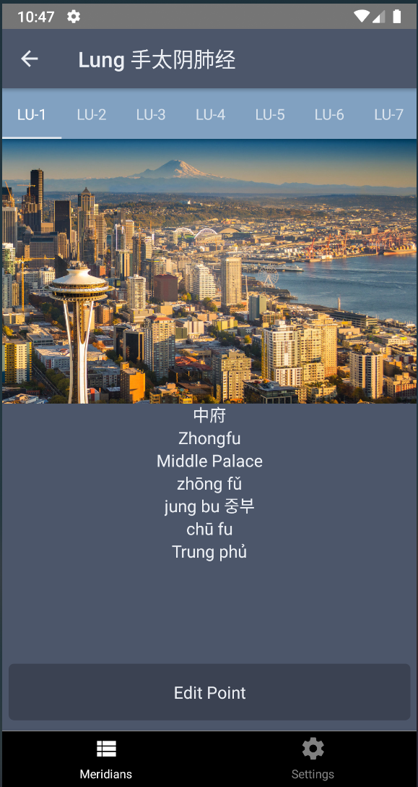
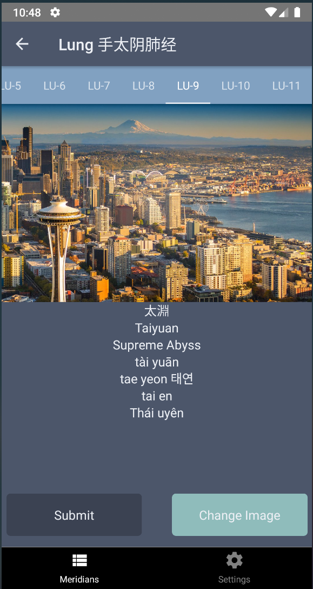

# Accupuncture App (name pending)

### Motivation
My dad got his accupuncture license this year and did a great at his school with the curriculum because of a memorization technique he implemented. He now teaches (remotely now) this technique to his students and believes a mobile application would be a great tool for aspiring accupuncturists.

### Tools
* React Native
* React Native Firebase
* Redux Toolkit
* Redux
* Styled Components

### Todos
* Stop using the same image
* Add loading message for different redux states
* Get extra meridian points data
* Refix settings page and figure out the sign out button positioning
* `Trying to figure out the design for the upload image page.`
* `Swiping between the different points. Probably makes the most sense to use the tab swipe component`

### Progress

##### Week 2
* Upload the image to Firebase Storage, and create an associated link to the image in Firestore
* Setup thunk middleware to dispatch loading and finished loading state changes when signing in (then also for the image upload...although its a little overwhelming right now)
* Create a slice for the userImages separate from the auth state, allow for uploading the image and all that inside the reducer
* Grab user images when the user is finished authenticating.
* Add a loading overlay for each individual accupuncture point when uploading an image

##### Week 1
* Creating a redux store to toggle between light and dark themes
* Setting up the stack navigator and tab screens, other basic navigation
* Styling is very basic because I am not exactly sure what information needs to be shown yet, keeping the pages simple for that specific reason
* Implement signing in through Firebase
* Aggregate accupuncture meridians data into csv format from Wikipedia (thanks to Regex101.com and Wiki Tables for being fairly consistents)
* Select an image to upload

