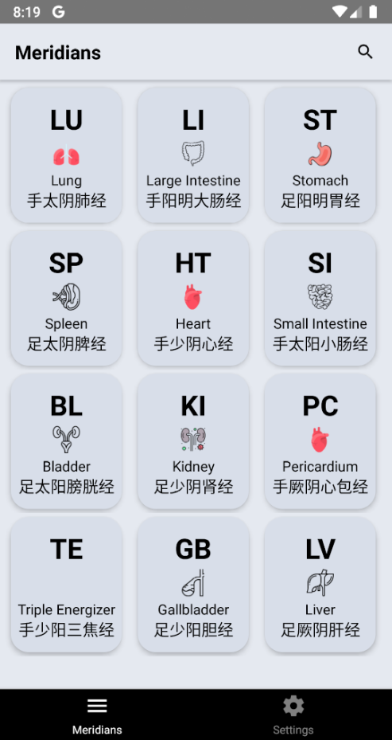
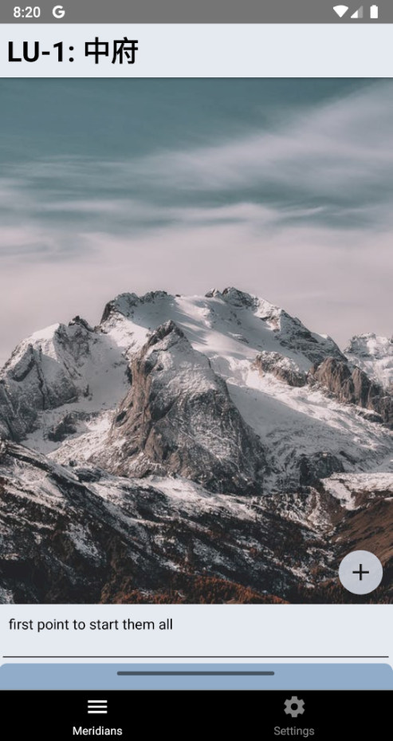
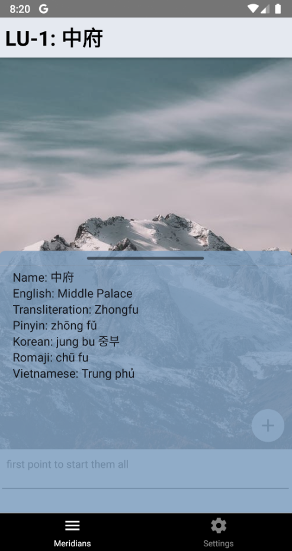
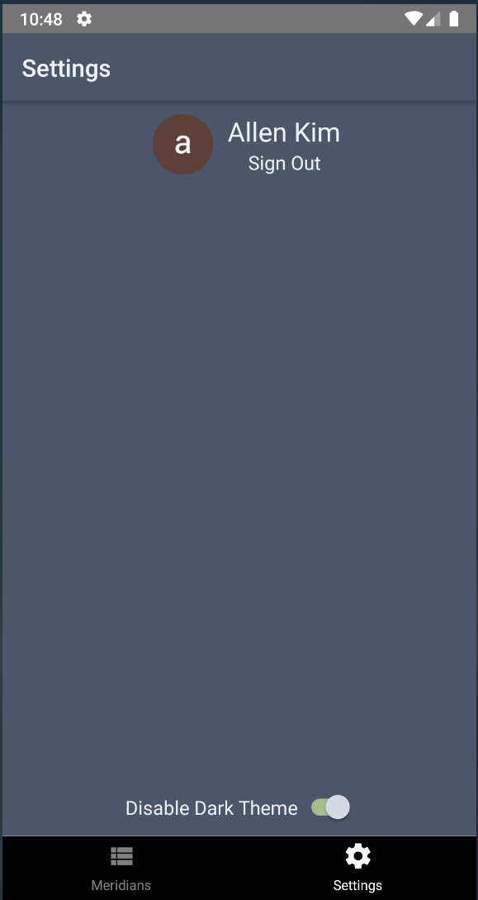
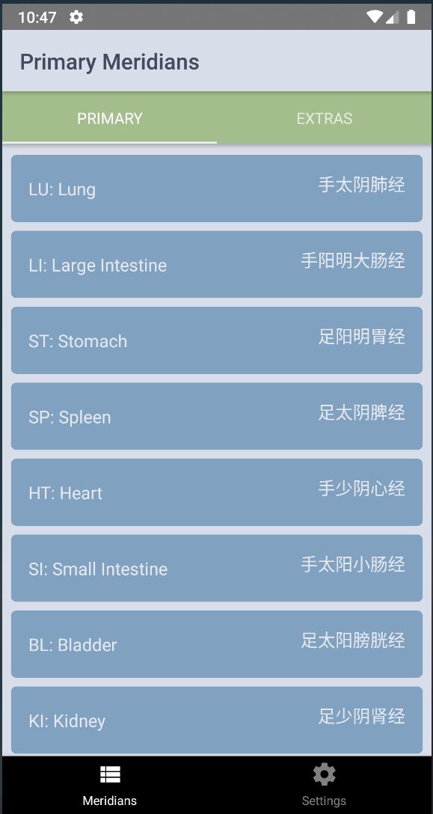

# Accupuncture App (name pending)

### Motivation

My dad got his accupuncture license this year and did a great at his school with the curriculum because of a memorization technique he implemented. He now teaches (remotely now) this technique to his students and believes a mobile application would be a great tool for aspiring accupuncturists.

### Random Thoughts

- I want to try Flutter because Google made it and I really liked Angular. Figuring they would use a lot of the same principles
- Formatting on a small screen is way nicer
- Elevation looks great

### Tools

- React Native
- Firebase
- Redux Toolkit
- Redux/Thunk
- Styled Components

### Todos

- Refix settings page and figure out the sign out button positioning
- Add search bar to search (user notes, location, accupuncture point names)?
- How to implement search algorithm because the data is a little spread out.
- ~Figure out why loading large tab screens take so long and how to work around that (switch to swiper)~
- ~Create information modal or drawer for each point (drawer instead)~
- ~Add loading message for different redux states~
- ~Add loading message for different redux states~
- ~Add loading message for different redux states~
- ~Add note feature for the points~
- ~Limit file size for image upload~
- ~Stop using the same image~
- ~Trying to figure out the design for the upload image image.~
- ~Swiping between the different points. Probably makes the most sense to use the tab swipe component~

### Progress

##### Week 3

- Rendering a modal in the React Navigation Header causes issues whether it be covering the screen, not registering touches or swipes if I don't cover, etc.
- Creating a full screen modal for the search, should be easier to manage
- Tweak search bar, not as important, but figure out which fields of data to search then how to search it
- Keep tweaking my personal website because responsiveness is terrible, I think it should be okay
- Refactor for code and new redesign
- Clean up styled components to inherit more properties when possible
- Create modal to give an option between switching or editing the image
- Add bottom sheet modal with accupuncture point details (Need to get location and other custom information into the application once that is collected)
- Find icons (temp) for various Meridians

##### Week 2

- Allow a user to edit an image after selecting one in their camera roll thanks to ([react-native-photo-editor](https://github.com/prscX/react-native-photo-editor))
- Add a note to the image, update note individually or note and selected image together
- Upload the image to Firebase Storage, and create an associated link to the image in Firestore
- Setup thunk middleware to dispatch loading and finished loading state changes when signing in (then also for the image upload...although its a little overwhelming right now)
- Create a slice for the userImages separate from the auth state, allow for uploading the image and all that inside the reducer
- Grab user images when the user is finished authenticating.
- Add a loading overlay for each individual accupuncture point when uploading an image

##### Week 1

- Creating a redux store to toggle between light and dark themes
- Setting up the stack navigator and tab screens, other basic navigation
- Styling is very basic because I am not exactly sure what information needs to be shown yet, keeping the pages simple for that specific reason
- Implement signing in through Firebase
- Aggregate accupuncture meridians data into csv format from Wikipedia (thanks to Regex101.com and Wiki Tables for being fairly consistents)
- Select an image to upload

